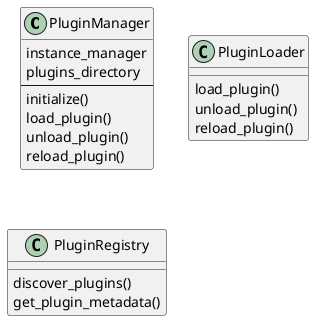
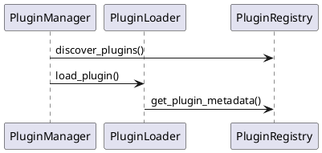

# UML Plugin for RETER Logical Thinking Server

**Version:** 1.0.0
**Author:** RETER Team
**Status:** ✅ Implementation Complete - Ready for Server Restart

## Overview

The UML plugin generates UML diagrams from Python code loaded into RETER. It provides three tools for creating different types of diagrams in both JSON and Markdown formats.

## Features

### 1. get_class_hierarchy
Returns the entire class hierarchy showing inheritance relationships.
- **Input**: Instance name, optional root class, format (json/markdown)
- **Output**: Class names only (no methods/attributes)
- **Formats**: JSON (structured data) or Markdown (tree visualization)

### 2. get_class_diagram
Generates class diagrams for specified classes.
- **Input**: Instance name, list of classes, format, optional method/attribute inclusion
- **Output**: Full class details with relationships, methods, and attributes
- **Formats**: JSON (structured data) or Markdown (PlantUML-compatible)

### 3. get_sequence_diagram
Creates sequence diagrams showing method calls between classes.
- **Input**: Instance name, list of classes, format, optional entry point
- **Output**: Call sequences and interactions
- **Formats**: JSON (structured data) or Markdown (PlantUML-compatible)

## Installation Status

### ✅ Completed Tasks
1. ✅ Plugin directory structure created
2. ✅ Plugin class implemented with base structure
3. ✅ All 3 tools implemented (get_class_hierarchy, get_class_diagram, get_sequence_diagram)
4. ✅ Manifest.json created for plugin discovery
5. ✅ Plugin structure verified and tested

### 📋 Next Steps

**The plugin is ready but needs server restart to be loaded:**

1. **Restart the RETER Logical Thinking MCP Server**
   - The plugin will be automatically discovered on startup
   - It will be loaded and registered with the MCP server

2. **Verify Plugin is Loaded**
   ```python
   # After restart, the plugin should appear in the available tools list
   # Tools will be available as:
   # - mcp__reter__mcp_uml_get_class_hierarchy
   # - mcp__reter__mcp_uml_get_class_diagram
   # - mcp__reter__mcp_uml_get_sequence_diagram
   ```

## File Structure

```
plugins/registry/uml/
├── __init__.py              # Plugin module entry point
├── plugin.py                # Main plugin implementation (571 lines)
├── manifest.json            # Plugin metadata for discovery
└── README.md               # This file
```

## Plugin Implementation Details

### Class Structure
- **Plugin class**: Inherits from `AnalysisPlugin`
- **Dependencies**: Requires `instance_manager` for RETER access
- **RETER Queries**: Uses REQL queries to extract class structures from loaded Python code

### Tool Schemas
All tools accept:
- `instance_name` (required): RETER instance containing Python code
- `format` (optional): "json" or "markdown" (default: "markdown")
- Additional tool-specific parameters

### Query Patterns Used

**Class Hierarchy Query:**
```reql
SELECT ?class ?className ?base ?baseName WHERE {
    ?class concept "py:Class" .
    ?class name ?className .
    OPTIONAL {
        ?class hasBase ?base .
        ?base name ?baseName
    }
}
```

**Class Details Query:**
```reql
SELECT ?method ?name WHERE {
    ?method concept "py:Method" .
    ?method definedIn ?class .
    ?class name "<className>" .
    ?method name ?name
}
```

**Method Calls Query:**
```reql
SELECT ?caller ?callerName ?callee ?calleeName ?callerClassName ?calleeClassName WHERE {
    ?caller concept "py:Method" .
    ?caller name ?callerName .
    ?caller calls ?callee .
    ?callee concept "py:Method" .
    ?callee name ?calleeName .
    ?caller definedIn ?callerClass .
    ?callee definedIn ?calleeClass .
    ?callerClass name ?callerClassName .
    ?calleeClass name ?calleeClassName
}
```

## Usage Examples

### Example 1: Get Class Hierarchy
```python
result = await mcp__reter__mcp_uml_get_class_hierarchy(
    instance_name="my_project",
    format="markdown"
)
print(result["diagram"])
```

Output:
```markdown
# Class Hierarchy

AnalysisPlugin
└─ Plugin
  └─ PythonBasicPlugin
  └─ PythonAdvancedPlugin
  └─ GanttPlugin
  └─ UMLPlugin

**Total classes:** 6
```

### Example 2: Get Class Diagram
```python
result = await mcp__reter__mcp_uml_get_class_diagram(
    instance_name="my_project",
    classes=["PluginManager", "PluginLoader", "PluginRegistry"],
    format="markdown",
    include_methods=True,
    include_attributes=True
)
print(result["diagram"])
```

Output:


### Example 3: Get Sequence Diagram
```python
result = await mcp__reter__mcp_uml_get_sequence_diagram(
    instance_name="my_project",
    classes=["PluginManager", "PluginLoader", "PluginRegistry"],
    format="markdown",
    entry_point="initialize"
)
print(result["diagram"])
```

Output:


## Testing

### Manual Import Test
```bash
cd reter-logical-thinking-server
python -c "
from src.logical_thinking_server.plugins.registry.uml.plugin import Plugin
plugin = Plugin(mock_instance_manager)
print(f'Plugin: {plugin.get_metadata().name}')
print(f'Tools: {len(plugin.get_tools())}')
"
```

**Test Result:** ✅ Plugin imported successfully, 3 tools registered

## Integration with RETER

The UML plugin relies on Python code being loaded into RETER first:

```python
# 1. Load Python code into RETER
await mcp__reter__add_knowledge(
    instance_name="my_project",
    source="/path/to/my_code.py",
    type="python"
)

# 2. After server restart, use UML tools
result = await mcp__reter__mcp_uml_get_class_hierarchy(
    instance_name="my_project",
    format="markdown"
)
```

## Categories
- visualization
- documentation
- uml
- diagrams

## Dependencies
None - this plugin has no external dependencies

## License
Same as RETER Logical Thinking Server

---

**Created:** 2025-11-18
**Implementation Status:** Complete
**Server Integration:** Pending restart
